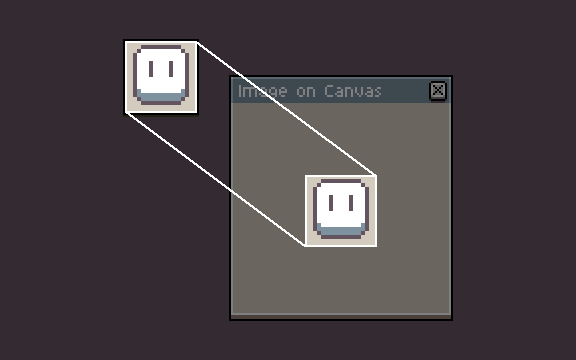
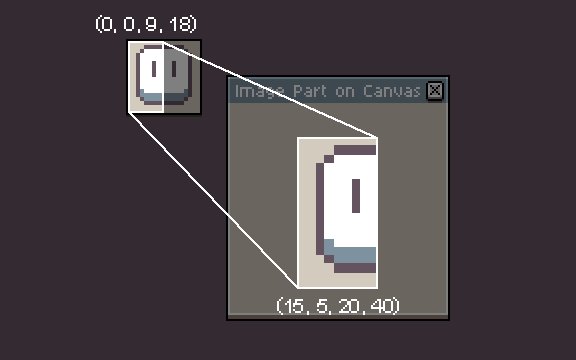

# GraphicsContext

```lua
local dlg = Dialog()
dlg:canvas{
  onpaint = function(ev)
    local gc = ev.context
    -- gc is a GraphicsContext
  end
}
```

## GraphicsContext.width

```lua
local width = gc.width 
```

Gets the width of the visible area in pixels. Canvas dimensions change when the dialog is resized by the user.

## GraphicsContext.height

```lua
local height = gc.height
```

Gets the height of the visible area in pixels. Canvas dimensions change when the dialog is resized by the user.

## GraphicsContext.antialias

```lua
local aa = gc.antialias
gc.antialias = true
```

Gets or sets whether paths and shapes are painted on using antialiasing.


## GraphicsContext.color

```lua
local color = gc.color
gc.color = Color(255)
```

Gets or sets the [color](color.md#color) to paint with the path functions.

## GraphicsContext.strokeWidth

```lua
local sw = gc.strokeWidth
gc.strokeWidth = 10
```

Gets or sets the width of lines painted when calling [GraphicsContext:stroke()](#graphicscontextstroke) or [GraphicsContext:strokeRect()](#graphicscontextstrokerect).

## GraphicsContext:save()

```lua
gc:save()
```

Saves current clipping information to
[restore](#graphicscontextrestore) it later.

## GraphicsContext:restore()

```lua
gc:restore()
```

## GraphicsContext:clip()

```lua
gc:clip()
```

Sets the [current path](#graphicscontextbeginpath) as a clipping area
for following drawing operations.

## GraphicsContext:strokeRect()

```lua
gc:strokeRect(rectangle)
```

Paints the edges of the given [rectangle](rectangle.md#rectangle) with
the [current color](#graphicscontextcolor) and [current width](#graphicscontextstrokewidth).

## GraphicsContext:fillRect()

```lua
gc:fillRect(rectangle)
```

Fills the given [rectangle](rectangle.md#rectangle) with the
[current color](#graphicscontextcolor).

## GraphicsContext:fillText()

```lua
gc:fillText(string, x, y)
```

Draws on the canvas the given text string, at a position specified by the _xy_-coordinates.

## GraphicsContext:measureText()

```lua
local size = gc:measureText(string)
```

Returns the [size](size.md#size) of the given text using the current font.

## GraphicsContext:drawImage()

```lua
gc:drawImage(image, x, y)
gc:drawImage(image, srcRect, dstRect)
gc:drawImage(image, srcX, srcY, srcW, srcH, dstX, dstY, dstW, dstH)
```

Draws on the canvas the given image.

If given _xy_-coordinates, the full image will be drawn at the specified position, in it's original scale.



If given source and destination [bounds](rectangle.md) (or their respective values), a part of the image is drawn (specified by the _srcRect_ (or _srcX_, _srcY_, _srcW_, and _srcH_), relative to the image) on the canvas (specified by the _dstRect_ (or _dstX_, _dstY_, _dstW_, and _dstH_), relative to the canvas). This allows drawing only a part of and/or scaling the image.



## GraphicsContext:drawThemeImage()

```lua
gc:drawThemeImage(partId, point)
gc:drawThemeImage(partId, x, y)
```

Draws on the canvas a theme part specified by the given _partId_, at a given [Point](point.md) or at specified _xy_-coordinates.

List of possible parts can be found in [theme.xml](https://github.com/aseprite/aseprite/blob/3c77928a6f193748bcd8cca15d45000dd58e11d5/data/extensions/aseprite-theme/theme.xml#L115).

## GraphicsContext:drawThemeRect()

```lua
gc:drawThemeRect(partId, rectangle)
gc:drawThemeRect(partId, x, y, w, h)
```

Draws on the canvas a theme part specified by the given _partId_, filling a given [Rectangle](rectangle.md) or at specified _xy_-coordinates, with given width and height. This method uses [nine-slice scaling](https://en.wikipedia.org/wiki/9-slice_scaling) for parts that have their [Slice's center](slice.md#slicecenter) defined. 

List of possible parts can be found in [theme.xml](https://github.com/aseprite/aseprite/blob/3c77928a6f193748bcd8cca15d45000dd58e11d5/data/extensions/aseprite-theme/theme.xml#L115).

## GraphicsContext:beginPath()

```lua
gc:beginPath()
```

Starts a new path, emptying the list of tracked sub-paths. This is the first method to call when drawing paths.

## GraphicsContext:closePath()

```lua
gc:closePath()
```

Closes the current sub-path by connecting the current point with the first point of the current sub-path.

## GraphicsContext:moveTo()

```lua
gc:moveTo(x, y)
```

Starts a new sub-path at the specified _xy_-coordinates. This is the second method to call (after [GraphicsContext:beginPath()](#graphicscontextbeginpath)) when drawing paths.

## GraphicsContext:lineTo()

```lua
gc:lineTo(x, y)
```

Adds a line to the current sub-path, from the last point to the specified _xy_-coordinates.

**Note:** This method doesn't draw on the canvas, to draw the path onto the canvas call [GraphicsContext:stroke()](#graphicscontextstroke) or [GraphicsContext:fill()](#graphicscontextfill).

## GraphicsContext:cubicTo()

```lua
gc:cubicTo(cp1x, cp1y, cp2x, cp2y, x, y)
```

Adds a cubic [Bézier curve](https://en.wikipedia.org/wiki/B%C3%A9zier_curve) to the current sub-path, from the last point to the specified _xy_-coordinates, with two control points (specified by _cp1x_, _cp1y_, _cp2x_, and _cp2y_ coordinates). 

**Note:** This method doesn't draw on the canvas, to draw the path onto the canvas call [GraphicsContext:stroke()](#graphicscontextstroke) or [GraphicsContext:fill()](#graphicscontextfill).

## GraphicsContext:rect()

```lua
gc:rect(rectangle)
```

Adds a given [Rectangle](rectangle.md) to the current sub-path.

**Note:** This method doesn't draw on the canvas, to draw the path onto the canvas call [GraphicsContext:stroke()](#graphicscontextstroke) or [GraphicsContext:fill()](#graphicscontextfill).

## GraphicsContext:roundedRect()

```lua
gc:roundedRect(rectangle, rx, ry)
```

## GraphicsContext:stroke()

```lua
gc:stroke()
```

Paints the edges of the [current path](#graphicscontextbeginpath) with
the [current color](#graphicscontextcolor) and [current width](#graphicscontextstrokewidth).

## GraphicsContext:fill()

```lua
gc:fill()
```

Fills the [current path](#graphicscontextbeginpath) with the [current
color](#graphicscontextcolor).
